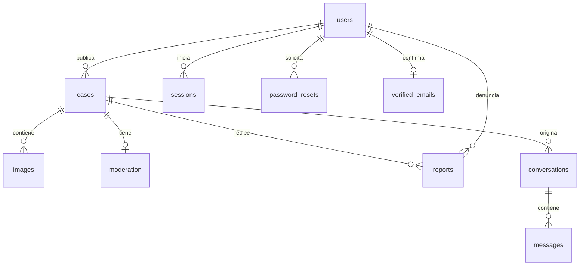

# API, datos y permisos

Complemento técnico de la [guía de estudio](GUIA_DE_ESTUDIO.md). Base de la API: `/api/v1`. Los formularios envían JSON con `Content-Type: application/json`; la sesión viaja en una cookie HttpOnly.

## Respuestas y errores

- Las listas incluyen `items`, `total`, `limit` y `offset`, salvo el historial de mensajes que usa un cursor.
- Los errores habituales tienen forma `{ "error": "Mensaje" }`.
- 400: campos o token inválidos; 401: falta sesión; 403: permiso insuficiente; 404: no existe o no es accesible; 409: conflicto; 413: cuerpo demasiado grande; 415: tipo de contenido incorrecto; 429: límite de solicitudes.
- Un 404 en una conversación no permite distinguir si pertenece a otra persona o no existe.

## Rutas

### Cuenta y acceso

| Método y ruta | Datos / función | Acceso |
|---|---|---|
| `POST /register` | `name`, `email`, `password`; crea USER y sesión | Público |
| `POST /login` | `email`, `password`; crea sesión | Público |
| `POST /logout` | Invalida la sesión actual | Cookie si existe |
| `GET /me` | Usuario con `id`, `name`, `email`, `role`, `emailVerified`, o null | Sesión opcional |
| `PATCH /me` | Solo `name` | Usuario autenticado |
| `POST /password/forgot` | `email`; respuesta genérica | Público, con límites |
| `POST /password/reset` | `token`, `password` | Token válido |
| `POST /email/verification` | Objeto vacío; usa correo de la sesión | Usuario autenticado |
| `POST /email/verify` | `token` | Token válido |
| `GET /health` | `{ "ok": true }` si SQLite responde | Público |

Contraseñas: 8–128 caracteres. Nombre: 1–80. El correo se normaliza con espacios exteriores eliminados y minúsculas. Cambiar correo no está implementado.

### Casos y fotografías

| Método y ruta | Datos / función | Acceso |
|---|---|---|
| `GET /cases` | `kind`, `q`, `mine`, `limit`, `offset` | Público; `mine=true` requiere sesión |
| `POST /cases` | Crea caso perdido o encontrado | Usuario autenticado |
| `GET /cases/:id` | Ficha y URLs de fotos | Público si visible |
| `PATCH /cases/:id` | Campos del caso, `state`, `photos` opcional | Propietario o ADMIN |
| `GET /images/:id` | Bytes y tipo MIME de una foto | Mismos permisos de visibilidad del caso |
| `POST /cases/:id/reports` | `reason`, entre 10 y 500 caracteres | Usuario autenticado distinto del propietario |

Ejemplo de cuerpo de creación:

```json
{
  "kind": "lost",
  "name": "Luna",
  "species": "Gato",
  "city": "Bogotá",
  "zone": "Chapinero",
  "description": "Tiene una mancha blanca en el pecho.",
  "size": "Pequeño",
  "color": "Gris",
  "photos": []
}
```

Esto es un ejemplo didáctico, no un caso precargado. Son obligatorios `kind`, `name`, `species`, `city`, `zone` y `description`. Se admiten además `size`, `breed`, `sex` y `color`.

- `kind`: `lost`, `found` o `adoption` al crear; no se cambia mediante edición.
- `state`: `open` o `resolved` para perdidos/encontrados; `available`, `paused` o `adopted` para adopciones. No equivale a visibilidad de moderación.
- `photos`: hasta tres data URLs JPG/PNG/WebP, máximo 2 MB por imagen.
- En PATCH, omitir `photos` conserva las anteriores; enviar una lista las reemplaza; enviar `[]` las retira.
- `canEdit`, `visibility`, `status`, `time` y `image` se calculan en la respuesta. No son campos que el cliente pueda usar para concederse permisos.
- Los listados devuelven 24 casos por defecto y hasta 100 por petición.

### Conversaciones

| Método y ruta | Datos / función |
|---|---|
| `POST /cases/:id/conversations` | `text`, `clientId`; inicia o reutiliza contacto con el propietario |
| `GET /conversations` | Bandeja del usuario, `offset`, páginas de 20 |
| `GET /conversations/:id` | Últimos 40 mensajes; `before` consulta anteriores |
| `POST /conversations/:id/messages` | `text`, `clientId`; responde |
| `POST /conversations/:id/read` | `lastId`; avanza el cursor de lectura |
| `PATCH /conversations/:id` | `closed`: true/false; modifica únicamente el cierre propio |

Todas requieren sesión. Solo participan propietario e interesado; el rol ADMIN no cambia esta regla. El servidor no acepta `sender_id` ni destinatario arbitrario desde el formulario.

`clientId` debe ser un identificador único de envío, por ejemplo `crypto.randomUUID()`. Reintentar el mismo mensaje con el mismo ID no vuelve a insertarlo; reutilizarlo para otro texto o conversación produce conflicto.

Límites: 2000 caracteres por mensaje, 30 mensajes por minuto y 10 conversaciones nuevas por día y cuenta. El historial se conserva si el caso se oculta o una persona cierra el contacto, pero no se permiten nuevos mensajes mientras siga bloqueado.

### Administración

Todas las rutas siguientes requieren ADMIN:

| Método y ruta | Datos / función |
|---|---|
| `GET /admin/summary` | Cantidades reales de cuentas, casos, reportes y ocultos |
| `GET /admin/cases` | `visibility=all/visible/hidden`, `offset` |
| `GET /admin/reports` | `status=pending/reviewed/dismissed`, `offset` |
| `PATCH /admin/cases/:id/moderation` | `visibility=visible/hidden`, `reason` |
| `PATCH /admin/reports/:id` | `status=reviewed/dismissed`, `reason` |
| `GET /admin/audit` | Historial de decisiones, `offset` |

Páginas de 25 elementos. Las justificaciones tienen entre 10 y 500 caracteres. Ocultar un caso marca como revisados sus reportes pendientes; restaurarlo no borra la auditoría.

## Tablas SQLite

La base utiliza 14 tablas. `CREATE TABLE IF NOT EXISTS` inicializa cada conjunto cuando arranca la aplicación; no hay todavía un gestor de migraciones versionadas.

| Tabla | Datos y propósito |
|---|---|
| `users` | Nombre, correo, derivación de contraseña y rol |
| `sessions` | Hash del token de sesión, usuario y vencimiento |
| `cases` | Propietario, tipo, estado, cuerpo JSON y fecha |
| `images` | Caso, MIME y bytes de cada fotografía |
| `moderation` | Visibilidad, motivo y actualización del caso |
| `reports` | Caso denunciado, denunciante, motivo, estado y fecha |
| `audit` | Actor, acción, referencia, motivo y fecha |
| `conversations` | Caso, participantes, cursores de lectura y cierres individuales |
| `messages` | Conversación, remitente, texto, ID de envío y fecha |
| `password_resets` | Hash de token de recuperación, usuario y vencimiento |
| `recovery_limits` | Contadores y ventanas de recuperación |
| `verified_emails` | Correo confirmado por usuario y fecha |
| `email_verifications` | Hash de token, usuario, correo y vencimiento |
| `verification_limits` | Contadores y ventanas de verificación |



El diagrama simplifica las relaciones: `conversations` tiene dos claves de usuario, `messages` identifica al remitente y `audit` al actor. Consulta los `CREATE TABLE` para las restricciones exactas.

## Reglas que no debes romper al extender el proyecto

1. Validar y autorizar en el servidor aunque exista validación en HTML.
2. Conservar el escape de texto al renderizar contenido de usuarios.
3. No exponer hashes, tokens ni correos de terceros en respuestas de casos/mensajes.
4. Mantener separados `state` del caso y `visibility` de moderación.
5. Agrupar escrituras dependientes en una transacción.
6. Releer datos tras un `await` si otra petición puede haberlos modificado.
7. Añadir una migración explícita antes de cambiar columnas de una instalación existente.
8. No servir `data`, `.env`, respaldos o scripts administrativos por HTTP.

La aplicación comprueba firmas y tamaños de imágenes, pero no realiza decodificación completa, análisis de archivos ni normalización de metadatos. Es una limitación que debe evaluarse antes de una apertura pública amplia.

## Notificaciones internas

Todas las rutas requieren sesión y operan exclusivamente sobre el usuario actual, también cuando su rol es ADMIN.

| Método y ruta | Contrato |
|---|---|
| GET /api/v1/notifications?before=ID | 25 elementos, orden ID descendente; devuelve items, unread, hasMore y nextBefore. Cursor opcional entero positivo. |
| POST /api/v1/notifications/ID/read | Marca un aviso propio como leído; 404 para avisos ajenos o inexistentes. Idempotente. |
| POST /api/v1/notifications/read | JSON {"throughId":123}; marca avisos propios hasta ese ID, preservando los recibidos después de cargar la bandeja. |

Cada elemento contiene id, kind (message, case_hidden, case_restored, adoption_application, adoption_accepted, adoption_rejected o adoption_withdrawn), targetId, created y read. El contador unread abarca todos los avisos propios. No incluye texto de mensajes, datos del remitente ni razones de moderación; los destinos vuelven a comprobar sus permisos.

La tabla notifications guarda usuario, tipo, destino, fecha y lectura. Los triggers de messages y moderation insertan dentro de la misma transacción del evento. Los reintentos de mensaje no insertan de nuevo; actualizar moderación sin cambiar visibilidad no genera aviso. La instalación añade tabla, índice y triggers sin modificar columnas existentes ni reconstruir eventos históricos. Los respaldos SQLite incluyen los avisos. La lectura de notificaciones y la lectura de conversaciones son independientes.

## Adopciones y solicitudes privadas

POST /api/v1/cases admite kind=adoption. Además de los campos comunes, requiere age (1–80 caracteres), care y requirements (1–500 cada uno). Las fotografías usan el contrato existente. El estado inicial siempre es available. PATCH del caso permite editar información/fotos, pero rechaza state en adopciones; ese campo tiene endpoints específicos.

GET del caso añade canManageAdoption (solo propietario) y myApplication (id y estado de la solicitud propia, o null); nunca devuelve solicitudes de terceros ni su texto. La moderación oculta publicaciones y fotos con las mismas reglas de los otros casos. ADMIN puede moderar y editar información pública, pero no gestionar solicitudes ajenas.

| Método y ruta | Función |
|---|---|
| POST /api/v1/cases/ID/adoption-applications | JSON {"message":"Presentación de 20 a 2000 caracteres"}; crea solicitud pending, devuelve id y state. Solo otra cuenta, caso visible y available. |
| PATCH /api/v1/cases/ID/adoption-state | JSON {"state":"paused"} o available; solo propietario. No permite reabrir adopted. |
| GET /api/v1/adoption-applications?role=applicant | Enviadas; role=owner consulta recibidas. offset no negativo, 20 elementos y filtro opcional caseId. Devuelve items, total, offset, limit. |
| GET /api/v1/adoption-applications/ID | Detalle privado, solo solicitante o propietario. ADMIN ajeno recibe 404. |
| PATCH /api/v1/adoption-applications/ID | JSON con state: accepted/rejected para propietario o withdrawn para solicitante. Solo desde pending; repetir el mismo estado autorizado es idempotente. |

Los registros contienen id, caseId, caseName, caseState, caseHidden, applicantName, message, state, created, updated, canManage y canWithdraw. Los estados aceptado/rechazado/retirado son finales. accepted representa la adopción concretada, no una preselección: exige publicación visible y available; cambia el caso a adopted y rechaza las demás pendientes. La transacción incluye todos los avisos y revierte completa ante un fallo. Un índice único parcial protege la selección única por mascota.

Cada solicitante tiene una sola solicitud por caso y hasta diez creaciones por 24 horas. Repetir el mismo mensaje devuelve la solicitud existente sin recrearla; cambiar el texto devuelve 409. Retirar no habilita un nuevo envío. El historial se conserva incluso con publicación oculta; no se entrega acceso a fotos ni a información privada de otras solicitudes.

La instalación crea la tabla adoption_applications con claves foráneas, unicidad por caso/solicitante y estados restringidos, sin cambiar columnas existentes. Los nuevos campos de mascota se almacenan en el cuerpo JSON de cases. Los respaldos SQLite incluyen solicitudes y avisos.


## Directorio veterinario

El CMS se documenta al final de este archivo y tiene rutas independientes del directorio.

| Método y ruta | Contrato |
|---|---|
| GET /api/v1/veterinaries | Solo fichas published; filtros city, service y q (nombre), offset no negativo; páginas de 20. Devuelve items, total, offset, limit. |
| GET /api/v1/veterinaries/ID | Ficha publicada; borradores y ocultas devuelven 404. |
| GET /api/v1/admin/veterinaries | Requiere ADMIN. Mismos filtros y status=all/draft/published/hidden. |
| GET /api/v1/admin/veterinaries/ID | Detalle administrativo. |
| POST /api/v1/admin/veterinaries | Crea borrador, siempre revision=1. |
| PATCH /api/v1/admin/veterinaries/ID | Edita; requiere revision actual y reason de 10–500 caracteres. Devuelve a draft y borra verifiedOn. |
| PATCH /api/v1/admin/veterinaries/ID/review | revision, reason y status=published/hidden. Publicar exige verifiedOn YYYY-MM-DD válido y no futuro. |

Campos obligatorios: name (120), city (80), address (200), phone (40), hours (300), services (300) y sourceUrl (500). Los números indican longitud máxima; no se admiten vacíos. La fuente es HTTPS sin credenciales; se guarda el enlace sin descargarlo desde el servidor. El teléfono admite dígitos y separadores habituales. Las respuestas añaden id, status, revision, verifiedOn y updated.

La tabla veterinaries guarda el cuerpo JSON, estado, revisión, fecha comprobada y fechas de creación/edición. Los cambios y sus entradas de audit son una transacción. Toda escritura posterior a crear exige la revisión actual; versiones obsoletas devuelven 409. No hay eliminación ni carga inicial. Los respaldos SQLite incluyen las fichas.

## CMS editorial

| Ruta | Contrato |
|---|---|
| GET /api/v1/editorial | Solo published; filtros kind=article/project y q (título/resumen); offset entero no negativo. Devuelve items, total, offset, limit=20. |
| GET /api/v1/editorial/ID | Detalle publicado. Borradores y ocultos devuelven 404 incluso con sesión ADMIN. |
| GET /api/v1/admin/editorial | ADMIN; mismos filtros y status=all/draft/published/hidden. |
| GET /api/v1/admin/editorial/ID | Detalle administrativo, incluida revision. |
| POST /api/v1/admin/editorial | ADMIN; crea siempre draft con revision=1. |
| PATCH /api/v1/admin/editorial/ID | ADMIN; revision y reason obligatorios. Editar devuelve a draft y limpia reviewedOn. |
| PATCH /api/v1/admin/editorial/ID/review | ADMIN; revision, reason y status=published/hidden. Publicar exige reviewedOn válido YYYY-MM-DD no futuro. |

Campos requeridos: kind (article/project), title (160 caracteres), summary (500), text (20.000) y sourceUrl (500, HTTPS sin credenciales). Todos los textos deben ser no vacíos. reason admite 10–500 caracteres. El cuerpo no admite modificar id, estado o revisión directamente. Se muestra texto plano escapado, sin HTML ni Markdown interpretados.

La tabla editorial guarda cuerpo JSON, estado, contador de revisión, fecha de revisión y fechas de creación/edición. Cada cambio y su evento create_editorial/edit_editorial/publish_editorial/hide_editorial en audit son atómicos. Versiones obsoletas devuelven 409. No hay eliminación, publicación programada ni separación obligatoria entre autor y revisor; la auditoría no conserva versiones anteriores del texto.

Rutas públicas de la aplicación: #/informacion, #/informacion/especie/ID (artículos, conservando la ruta existente), #/nuestro-trabajo y #/nuestro-trabajo/ID (proyectos). La ruta de especie funciona como detalle editorial; no implementa todavía el modelo científico de taxonomía. Búsqueda SQL literal sobre título/resumen, sin interpretación de comodines; las equivalencias de mayúsculas de SQLite no cubren todo Unicode.
## Cola de correo

GET /api/v1/admin/mail requiere ADMIN. Devuelve counts por estado y los últimos 50 items con id, kind, status, attempts, next_attempt, created, updated y error_code. No devuelve destinatarios, cuerpo ni hashes de tokens. GET /api/v1/site indica si el servidor es demo; no expone configuración privada.

mail_outbox conserva id, kind, token_hash, payload, status, attempts, next_attempt, expires, created, updated y error_code. Los estados son pending, sending, sent, failed y expired. sent significa aceptación del transporte o escritura local. En estados terminales se limpia payload; se conservan metadatos operativos. Los motivos de fallo se reducen a códigos, sin copiar errores sensibles del proveedor.

Las rutas existentes de recuperación y verificación conservan sus contratos HTTP. La creación del token y su trabajo es una única transacción. El worker revisa la existencia y vigencia del token antes de cada envío; un envío ya en curso no puede retirarse. Consulta cada segundo, con lotes de hasta 25 y un único procesador por instancia. Tras cerrar no vuelve a escribir en SQLite; sending se recupera como pending al iniciar una única instancia nueva. Los reintentos se limitan a ocho, con 30s/60s/120s y crecimiento hasta 15 minutos; Retry-After puede aumentar la espera, sin pasar la caducidad para reevaluar el trabajo.

Resend recibe Idempotency-Key estable. La vigencia máxima de los enlaces es 24 horas, que coincide con la ventana documentada de idempotencia del proveedor. La escritura local usa el identificador como nombre de archivo. Las copias de seguridad incluyen trabajos pendientes y sus enlaces; deben mantenerse privadas. No hay reintento manual ni limpieza automática del historial de metadatos.
## Comentarios públicos

| Ruta | Contrato |
|---|---|
| GET /api/v1/cases/ID/comments | Público. Caso visible obligatorio; comentarios visibles y, con sesión de autor, sus propios ocultos. before entero positivo, página de 20, items/hasMore/nextBefore. |
| POST /api/v1/cases/ID/comments | Cuenta obligatoria; text de 1–1000 caracteres, clientId alfanumérico/guiones de 16–80. Devuelve 201 o 200 en reintento idéntico. |
| PATCH /api/v1/comments/ID | Solo autor; revision actual y text para editar, o status=deleted para retirar. No puede modificar la moderación. |
| GET /api/v1/admin/comments | ADMIN; status=visible/hidden/deleted/all, cursor before. Incluye comentarios de casos ocultos. |
| PATCH /api/v1/admin/comments/ID | ADMIN; revision, status=visible/hidden y reason de 10–500. No edita el texto ni restaura comentarios retirados. |

La respuesta incluye id, caseId, authorName, text, status, revision, created, updated y canEdit. No expone correo, clientId ni hash de petición. comments guarda la relación con caso/autor, texto, revisión y un hash del texto original para reconocer reintentos incluso después de editar o retirar. La retirada limpia text y conserva metadatos e idempotencia. Los casos incluyen commentCount, solo de comentarios visibles.

Un cambio con revisión obsoleta devuelve 409. Las decisiones administrativas y hide_comment/restore_comment en audit se guardan en una transacción. comment_limits restringe diez cambios de autor por minuto; un recuento de comments limita 50 publicaciones por 24 horas, incluyendo retirados. Los reintentos idénticos no consumen límites. No se usan muestras visuales como fuente del listado público: se consulta SQLite.

## Denuncias de comentarios

- `POST /api/v1/comments/:id/reports`: cuenta autenticada, comentario ajeno visible y caso público. Cuerpo `{reason}` (10–500 caracteres). Devuelve 201, o 200 al repetir el mismo motivo; otro motivo devuelve 409. Máximo 20 denuncias por cuenta en 24 horas.
- `GET /api/v1/admin/comment-reports?status=pending&before=...`: solo ADMIN, filtros pending/reviewed/dismissed/all y cursor de 20 filas. Incluye motivo privado, nombres, revisión denunciada y texto/estado/revisión actuales.
- `PATCH /api/v1/admin/comment-reports/:id`: solo ADMIN, cuerpo `{decision, reason, commentRevision}`. Decisiones hide/reviewed/dismissed. La denuncia debe estar pendiente y la revisión coincidir; conflictos devuelven 409. Ocultación, resolución y auditoría son atómicas.

La tabla `comment_reports` conserva motivo, revisión denunciada, decisión, responsable y fechas, con unicidad por comentario y denunciante. No conserva el texto anterior del comentario. Los motivos no se incluyen en rutas públicas ni avisos; los respaldos SQLite incluyen las denuncias. Los comentarios públicos incluyen canReport para indicar disponibilidad del formulario.
