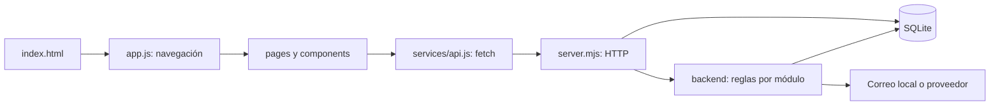

# Guía de estudio de Buscados

Esta guía explica el código que funciona hoy. Puedes leerla junto al editor, sin conocer todo el proyecto de antemano. Primero ejecuta los pasos del [README](../README.md).

## 1. La idea principal

Hay dos programas trabajando juntos:

- **Navegador:** muestra HTML/CSS, escucha clics, envía peticiones y representa respuestas.
- **Servidor Node:** comprueba permisos, valida datos, consulta SQLite y entrega archivos o JSON.

Cerrar el navegador no borra los datos: están en SQLite. Ocultar un botón tampoco protege un dato: el permiso se comprueba en el servidor.



Para distinguir la demo de GitHub Pages del backend y localizar dónde hacer cambios, consulta las [notas para desarrolladores](DESARROLLO.md). La configuración y los comandos completos están en [ejecución y operación](OPERACION.md).

## 2. Orden recomendado de lectura

| Paso | Abre | Qué debes entender |
|---|---|---|
| 1 | `index.html` | Los contenedores vacíos que JavaScript rellenará |
| 2 | `frontend/js/app.js` | Cómo el hash selecciona una pantalla |
| 3 | `frontend/js/pages/core.js` | Cómo se construye el inicio y los listados |
| 4 | `frontend/js/services/api.js` | Cómo `fetch` pide y recibe JSON |
| 5 | `server.mjs` | Cómo una URL se convierte en una operación sobre datos |
| 6 | `frontend/js/components/modal.js` | Cómo un formulario crea o edita un caso |
| 7 | `backend/messages.mjs` | Participantes, historial e idempotencia |
| 8 | `tests/server.test.mjs` | Cómo verificar un recorrido sin datos de producción |

No necesitas empezar por todos los archivos CSS ni por la administración.

## 3. La entrada HTML

`index.html` define la estructura estable:

| Elemento | Función |
|---|---|
| `.sidebar`, `#main-nav` | Navegación de escritorio y menú móvil |
| `#page-root` | Pantalla que cambia al navegar |
| `#context-panel` | Panel lateral de ayuda |
| `#mobile-nav` | Barra inferior en móvil |
| `#account-area` | Acceso a cuenta o botones para ingresar |
| `#modal-root` | Formulario flotante de casos |
| `#toast-root` | Mensajes breves de confirmación |

El script usa `type="module"`, por lo que puede importar otros archivos. No hay un compilador que convierta los módulos: el navegador los solicita directamente al servidor.

## 4. Navegación y eventos

### `frontend/js/app.js`

Es el coordinador de la interfaz:

1. Importa pantallas y controladores.
2. Restaura la sesión mediante `loadSession()`.
3. Lee `location.hash`, por ejemplo `#/perdidos`.
4. Selecciona la función de la pantalla dentro de `render()`.
5. Inserta su HTML en `#page-root`.
6. Llama a los controladores que conectan eventos con ese HTML nuevo.

`renderVersion` impide que una respuesta antigua sobrescriba una página más reciente. Imagínate abrir Inicio y, antes de que termine de cargar, abrir Mensajes: solo debe mostrarse la navegación más reciente.

Las rutas privadas redirigen visualmente al login. Esto mejora la experiencia, pero **la autorización real está en la API**.

`data-*` son atributos que conectan HTML y JavaScript. Ejemplos:

```html
<button data-modal="lost">Reportar perdido</button>
<div data-live-cases data-kind="lost"></div>
```

El primero identifica qué formulario abrir. El segundo indica a `cases.js` dónde representar resultados y qué tipo de caso solicitar.

### Otros archivos de navegación

- `config.js`: marca y catálogo de secciones. `app.js` prioriza las principales y agrupa otras en Más espacios. `useDemoData` es informativo en esta versión; cambiarlo no implementa por sí solo otro backend.
- `history-state.js`: contador de navegación para el botón Volver. El nombre global `__nexoNavigationCount` es heredado.
- `admin-navigation.js`: ayudante heredado del panel anterior; el HTML administrativo actual utiliza enlaces normales y ya no lo carga.

## 5. Qué hace cada pantalla

| Archivo | Responsabilidad |
|---|---|
| `pages/core.js` | Inicio social y estructura de listados de perdidos/encontrados |
| `pages/detail.js` | Ficha de un caso, fotos, edición, contacto y denuncia |
| `pages/more.js` | Explorar |
| `pages/auth.js` | HTML de login, registro, recuperación y nueva contraseña |
| `pages/account.js` | Pantalla de cuenta, edición del nombre y confirmación de correo |
| `pages/veterinaries.js` | Directorio público, búsqueda y paginación |
| `pages/adoptions.js` | Solicitud privada, bandejas, pausa y confirmación final de adopción |
| `pages/notifications.js` | Bandeja de avisos, cursor y lectura persistente |
| `pages/messages.js` | Bandeja, historial, envío, lectura y cierre de conversaciones |
| `pages/discovery.js` | Biblioteca, categorías y proyectos editoriales aún incompletos |
| `cases.js` | Login/registro, casos propios, búsqueda y controles de edición/resolución |
| `recovery.js` | Eventos de los formularios de recuperación |
| `report-case.js` | Envío de una denuncia sobre un caso |

En algunos archivos conviven funciones que producen HTML y funciones que conectan eventos. Busca nombres como `Page`, `View` y `bind...` para distinguirlas.

## 6. Componentes compartidos

| Archivo | Para qué se usa |
|---|---|
| `components/ui.js` | Tarjetas, encabezados, filtros, vacíos y `escapeHTML` |
| `components/icons.js` | Iconos SVG locales reutilizables |
| `components/social.js` | Publicación del feed, panel lateral y acción Compartir |
| `components/modal.js` | Formulario de casos, previsualización de fotos y avisos |
| `components/session-menu.js` | Estado del usuario en memoria y menú de cuenta |

`escapeHTML` convierte caracteres como `<` en entidades antes de insertarlos en HTML. Los valores escritos por usuarios no deben interpolarse directamente en `innerHTML`.

`getDemoRole()` conserva un nombre histórico, pero devuelve el rol de la **sesión real**. No existe un selector que permita convertirse en administrador.

En el formulario de casos:

- `FormData` recoge campos con atributo `name`.
- `FileReader` transforma las fotos a data URLs para enviarlas por JSON.
- Las previsualizaciones usan URLs temporales; `URL.revokeObjectURL` libera esos recursos al cerrar.
- `AbortController` elimina los listeners de un modal cerrado.
- El servidor vuelve a validar campos y fotografías aunque el navegador ya los haya comprobado.

## 7. El cliente HTTP

`services/api.js` centraliza las peticiones:

```js
const result = await api.listCases({ kind: 'lost', limit: 24, offset: 0 });
// result.items: casos; result.total: cantidad; result.limit/offset: página
```

`request()` agrega el prefijo `/api/v1`, incluye la cookie de la sesión y convierte el cuerpo a JSON. Si falla, lanza un `Error`; los errores HTTP incluyen `error.status`.

Una operación sigue este patrón:

```js
try {
  const result = await request('/me');
  // Representar result.
} catch (error) {
  // Mostrar error.message con textContent.
}
```

No pongas contraseñas, claves del correo o tokens administrativos en este módulo: se descarga al navegador.

## 8. El servidor, por bloques

Abre `server.mjs` y busca estos nombres:

| Bloque | Qué resuelve |
|---|---|
| `createApp(options)` | Construye el servidor; las pruebas pueden usar otra base |
| `db.exec(...)` inicial | Crea tablas e índices base si no existen |
| `install...` | Inicializa módulos y sus tablas adicionales |
| `currentUser` / `requireUser` | Resuelve la cookie y exige una sesión válida |
| `session` | Crea una sesión y escribe la cookie HttpOnly |
| `pack` | Convierte una fila de caso en la respuesta pública de la API |
| `validate` | Limita y normaliza los campos editables del caso |
| `photos` | Limita cantidad/tamaño y verifica formatos por sus firmas |
| `json` | Lee el cuerpo de una petición JSON y limita su tamaño |
| `http.createServer` | Despacha solicitudes por ruta y método |
| bloque final | Arranca el proceso solo cuando se ejecuta directamente |

`import {createApp} from '../server.mjs'` no abre automáticamente el puerto 3000. Esto permite a los tests usar puertos libres.

La API devuelve JSON. Los archivos públicos se entregan mediante una lista de carpetas y extensiones permitidas. La base, `.env`, respaldos y correos locales no se sirven como archivos públicos.

## 9. Módulos del backend

| Archivo | Regla principal |
|---|---|
| `backend/runtime.mjs` | Lee configuración y entrega correo a archivo local o Resend |
| `backend/account.mjs` | Editar solo el nombre; confirmar correo mediante token |
| `backend/recovery.mjs` | Restablecer contraseña, consumir enlaces y cerrar sesiones |
| `backend/moderation.mjs` | Denuncias, visibilidad de casos y decisiones auditadas |
| `backend/messages.mjs` | Solo dos participantes pueden consultar una conversación |

Cada instalador recibe la conexión SQLite y devuelve métodos como `route()`. Una ruta devuelve `true` si atendió la petición; si no le corresponde, permite que el servidor continúe buscando.

Las consultas usan parámetros `?` en lugar de concatenar valores del usuario en SQL. Los nombres de columnas dinámicos se seleccionan de opciones internas controladas.

## 10. Tres recorridos que conviene seguir en el editor

### A. Publicar una mascota

```text
Botón data-modal="lost"
  → app.js / openModal()
  → modal.js recoge campos y fotos
  → api.saveCase()
  → POST /api/v1/cases
  → requireUser + validate + photos
  → INSERT cases e images en una transacción
  → pack() devuelve el caso
  → navegación a #/mascota/:id
  → detail.js representa la ficha
```

Una transacción usa `BEGIN`, `COMMIT` y `ROLLBACK`: si falla guardar una foto, no debe quedar un caso guardado a medias.

### B. Enviar un mensaje

```text
Formulario de contacto en detail.js
  → bindMessages()
  → POST /cases/:id/conversations
  → comprueba propietario, moderación y límites
  → crea/reutiliza conversación e inserta mensaje
  → #/mensajes/:id
```

`clientId` identifica el envío. Si se pierde una respuesta y se reintenta con el mismo identificador, no se duplica el mensaje. Eso se llama **idempotencia**.

Los mensajes tienen IDs crecientes. El cursor `before` pide mensajes anteriores; la lectura avanza hasta un ID que realmente existe en esa conversación.

### C. Recuperar acceso

```text
recovery.js → /password/forgot
  → servidor genera token aleatorio
  → guarda su hash y vencimiento
  → runtime.mjs entrega el enlace
  → usuario abre #/restablecer?token=...
  → /password/reset valida y consume el token
  → actualiza contraseña y elimina sesiones
```

La verificación de correo tiene tablas y tokens separados: un enlace para confirmar correo no sirve para cambiar la contraseña.

## 11. Cómo se organiza el diseño

El orden de carga importa: una regla posterior puede sobrescribir otra anterior. `social.css` se carga al final para unificar la aplicación pública.

| CSS | Responsabilidad |
|---|---|
| `tokens.css` | Variables de colores, tipografías, radios y tamaños |
| `styles.css` | Elementos base, controles y estructura general |
| `pages.css` | Listados, detalle, formularios, modal y responsive original |
| `session.css` | Menús y elementos de sesión; contiene estilos heredados |
| `content.css` | Biblioteca y contenido editorial |
| `release.css` | Ajustes de la primera entrega funcional |
| `moderation.css` | Denuncias y panel de moderación |
| `messages.css` | Bandeja, burbujas e interfaz de mensajes |
| `account.css` | Panel de cuenta |
| `admin.css` | Estructura del panel administrativo |
| `social.css` | Apariencia final del sitio público: feed y navegación |

Para cambiar la apariencia actual, empieza por `social.css`; para componentes nuevos, identifica si corresponden a una hoja específica. El panel administrativo no utiliza la clase `.social-app`.

## 12. Qué es histórico y qué está activo

- `frontend/js/data/content-data.js`: activo; contiene categorías y esquemas editoriales. No es la base de casos.
- `frontend/js/data/demo-data.js`: datos históricos del prototipo; el servicio actual no los importa.
- En `ui.js` y ciertas hojas CSS quedan componentes antiguos no usados por el feed actual. No son prueba de que esas funciones estén implementadas.
- `docs/auth-navigation.md` y `docs/content-architecture.md`: documentación anterior con aviso histórico.
- `.github/agents/codex.agent.md`: instrucciones de colaboración, no código de ejecución.

## 13. Archivos de operación y pruebas

- `scripts/admin.mjs`: asigna ADMIN a una cuenta existente desde una terminal local.
- `scripts/backup.mjs`: crea y verifica un respaldo de la base, sin copiar simplemente un SQLite activo.
- `scripts/check.mjs`: comprueba sintaxis/imports y estructura básica de estilos.
- `tests/*.test.mjs`: crean bases temporales, levantan el servidor y verifican HTTP y datos.

Puedes ejecutar una sola prueba mientras estudias:

```powershell
node --test tests/messages.test.mjs
```

No confundas la base temporal del test con `data/buscados.sqlite`. Las pruebas no deberían modificar tus cuentas reales.

## 14. Ejercicios progresivos

1. **Presentación:** cambia un texto del encabezado en `pages/core.js`, recarga y localiza qué HTML cambió.
2. **Estilos:** cambia un radio o color en `social.css`; comprueba inicio y formularios.
3. **Lectura:** sigue `api.listCases()` hasta la consulta SQL y explica `limit` y `offset`.
4. **Permisos:** ejecuta `moderation.test.mjs` e identifica por qué un usuario recibe 403.
5. **Datos:** dibuja la relación entre un caso, sus fotos y sus conversaciones usando [API y datos](API_Y_DATOS.md).
6. **Cambio funcional:** antes de añadir un campo, enumera todas las capas que cambiarían: formulario, validación, respuesta, detalle y prueba.

Después de un cambio funcional:

```powershell
node scripts/check.mjs
node --test tests/*.test.mjs
```

Completa la revisión manual de [REVISION.md](REVISION.md). Que un archivo no tenga errores de sintaxis no garantiza que sus botones funcionen bien en el navegador.

### Notificaciones persistentes

backend/notifications.mjs instala la tabla y los triggers después de los módulos de mensajes y moderación. Cada trigger participa en la transacción del evento original. La API restringe todas las consultas y cambios al usuario de la sesión. frontend/js/pages/notifications.js carga la bandeja y controla sus acciones; el contador y la lectura de avisos son independientes de los cursores de mensajes.


### Adopciones

backend/adoptions.mjs instala adoption_applications y controla solicitudes y estados de adopción. server.mjs comparte los casos y las fotos existentes, valida edad/cuidados/requisitos y restringe los cambios de estado al módulo de adopciones. El formulario compartido añade esos tres campos cuando el tipo es adoption.

frontend/js/pages/adoptions.js representa las acciones del detalle y las bandejas Enviadas/Recibidas. Las solicitudes se identifican por UUID. Las notificaciones enlazan al detalle privado, donde la API vuelve a comprobar quién consulta. Los estados de solicitudes y publicaciones se describen en API_Y_DATOS.md.


### Directorio veterinario

backend/veterinaries.mjs define fichas, validación, publicación y auditoría. Se despacha antes de moderation.route porque esta última atiende las demás rutas administrativas. frontend/js/pages/veterinaries.js carga solo las fichas publicadas; frontend/js/admin-veterinaries.js gestiona creación, edición y revisión. Cada escritura usa revision para impedir sobreescrituras obsoletas; publicar requiere una fecha y justificación registradas por el administrador.

### CMS editorial

backend/editorial.mjs instala la tabla editorial y atiende la API antes del módulo de moderación. frontend/js/admin-editorial.js permite crear, editar, previsualizar y revisar entradas. frontend/js/pages/editorial.js representa el contenido público y controla búsqueda/paginación; discovery.js conecta las rutas existentes con este módulo. Las antiguas consultas a arreglos editoriales de demostración se retiraron del cliente API.

Lee tests/editorial.test.mjs para permisos, concurrencia, rollback de auditoría, filtros y persistencia; editorial-interactions.test.mjs para la recuperación de búsqueda; editorial-admin-interactions.test.mjs para envío de campos y bloqueo de decisiones sobre cambios sin guardar. Estos dos últimos usan dobles de DOM, no un navegador.
### Cola y demostración

backend/mail-queue.mjs controla persistencia y reintentos; runtime.mjs implementa el transporte y clasifica fallos HTTP. account.mjs y recovery.mjs insertan token y trabajo dentro de una transacción. server.mjs inicia y detiene el procesador; frontend/js/admin-mail.js muestra el estado al administrador.

scripts/demo.mjs usa data/demo exclusivamente desde su comando de arranque y reutiliza frontend/js/data/demo-data.js. La marca demo_seed evita repetir ejemplos o sobrescribirlos. frontend/assets/demo contiene copias locales de las fotos del prototipo. scripts/showcase.mjs genera frontend/muestrario.html desde la demo iniciada; es una vista estática con los mismos componentes, con enlaces a la aplicación real.

Comandos: npm run demo para la demostración, npm start para datos normales, npm test para las pruebas y npm run check para comprobación estática. No hay dependencias npm que instalar.
### Comentarios públicos

backend/comments.mjs instala comments y comment_limits y atiende las rutas antes de moderation.route. frontend/js/pages/comments.js contiene vistas y eventos del detalle; admin-comments.js implementa la revisión administrativa. social.js muestra el contador calculado por la API y enlaza al detalle. scripts/demo.mjs convierte los comentarios estáticos anteriores una sola vez con demo_seed versión 2.

Las pruebas están en comments.test.mjs y comment-interactions.test.mjs. La primera combina HTTP, permisos y persistencia; la segunda usa dobles de DOM para fallos de red, cursores e identificadores de reintento. Los comentarios son públicos; messages.mjs sigue atendiendo conversaciones privadas independientes.

### Denuncias de comentarios

`backend/comment-reports.mjs` gestiona privacidad, duplicados y resolución auditada. `frontend/js/pages/comments.js` contiene el formulario público y `frontend/js/admin-comment-reports.js` la bandeja administrativa. `tests/comment-reports.test.mjs` cubre permisos, transacciones, conflictos, límites, paginación y reinicio; `tests/comment-report-interactions.test.mjs` comprueba recuperación de controles con dobles de DOM.
