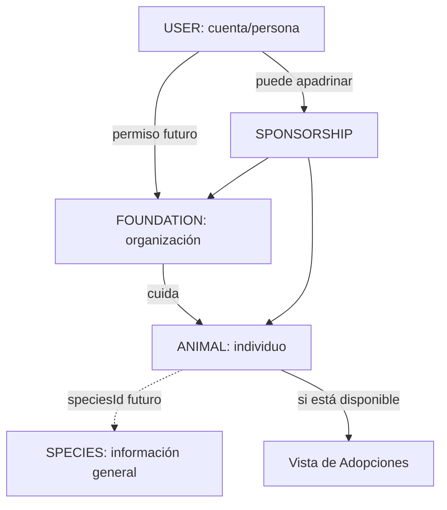

# Fundaciones, animales y apadrinamiento

## Principio central

    USER ≠ FOUNDATION
    ANIMAL ≠ SPECIES
    SPONSORSHIP ≠ ADOPTION

Una fundación puede ser gestionada posteriormente por varios usuarios autorizados. No se añadió `role: FOUNDATION`.

## Foundation

Representa una organización. Incluye identidad, misión, ubicación general, contacto, necesidades, estados de moderación, usuarios gestores y animales relacionados por ID.

Estados previstos: `pending`, `verified`, `rejected` y `suspended`. La única organización actual es ficticia y aparece como **Datos de demostración**.

## Animal

Representa un individuo concreto bajo cuidado. No describe una especie.

- `foundationId` enlaza la organización responsable.
- `speciesId` permanece `null` mientras no existan fichas científicas.
- `temporarySpeciesLabel` muestra una referencia provisional.
- Adopción, cuidado y apadrinamiento tienen estados separados.

Un único Animal podrá aparecer en la fundación y en Adopciones filtrando por `adoptionStatus`; no debe copiarse.

## Sponsorship

Relacionará `USER ↔ ANIMAL ↔ FOUNDATION`. El contrato contempla estado, ciclo, tipo de apoyo, necesidades, actualizaciones y reportes de uso.

## Apadrinamiento actual = DEMO

No existe pago, donación real, transacción, contrato, persistencia, verificación, seguridad ni pasarela. La interfaz solo explica el concepto. `sponsorships` permanece vacío.

## Transparencia futura

Una implementación real deberá permitir actualizaciones, fotografías, evolución, necesidades, cambios de estado y uso verificable del apoyo. Esto no equivale a un sistema contable y no se implementó en esta fase.
